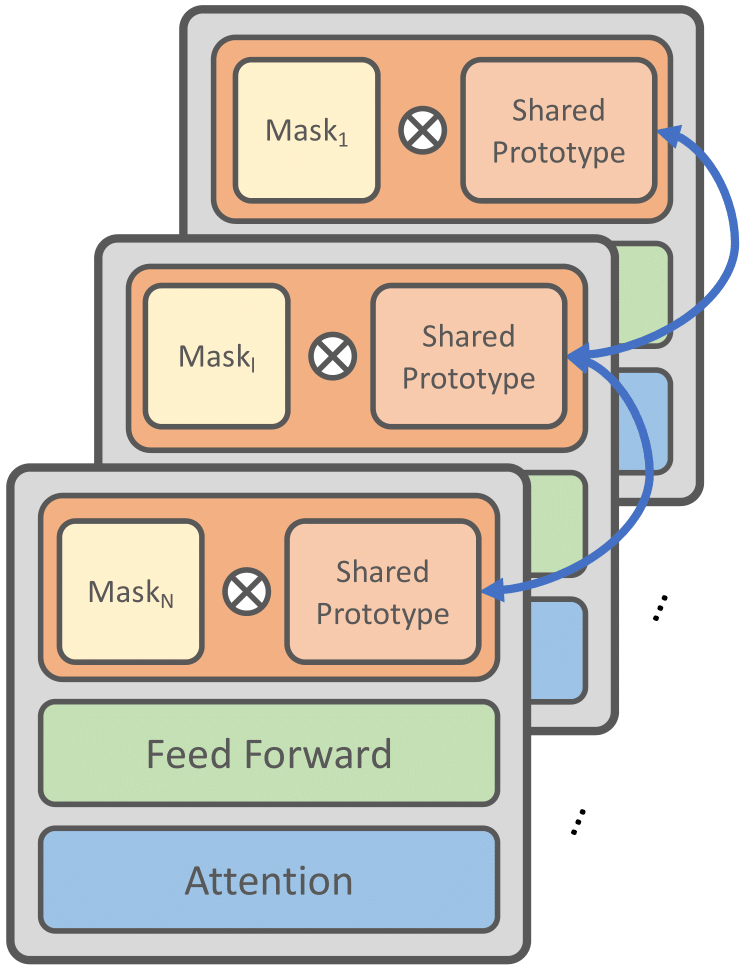

# One Network, Many Masks: Towards More Parameter-Efficient Transfer Learning
This repository is the official implementation of our ACL'23 paper "One Network, Many Masks: Towards More Parameter-Efficient Transfer Learning". [[ArXiv]](https://arxiv.org/abs/2305.17682)

# Overview



Fine-tuning pre-trained language models for multiple tasks tends to be expensive in terms of storage. To mitigate this, parameter-efficient transfer learning (PETL) methods have been proposed to address this issue, but they still require a significant number of parameters and storage when being applied to broader ranges of tasks. To achieve even greater storage reduction, we propose PROPETL, a novel method that enables efficient sharing of a single PETL module which we call prototype network (e.g., adapter, LoRA, and prefix-tuning) across layers and tasks. We then learn binary masks to select different sub-networks from the shared prototype network and apply them as PETL modules into different layers. We find that the binary masks can determine crucial information from the network, which is often ignored in previous studies. Our work can also be seen as a type of pruning method, where we find that overparameterization also exists in the seemingly small PETL modules. We evaluate PROPETL on various downstream tasks and show that it can outperform other PETL methods with approximately 10% of the parameter storage required by the latter.


# How to reimplement our work

In our work, we have conducted experiments on both encoder-only models (RoBERTa) and encoder-decoder models (T5).

Our work is divided into two main sections:
- The first section focuses on the RoBERTa experiments using different variations including ProAdapter, ProLoRA, and ProPrefix. 
- The second section, ProPETL-T5, applies our methods on the T5 model.

## Prerequisites

Ensure that you have a suitable environment to run our code. We primarily use Pytorch 1.11.0+cu113 and A100. You can install the necessary requirements for each part of the codebase individually using the provided requirements.txt files.

## Reproducing the Experiments

### Encoder-Only (RoBERTa) Experiments
Navigate to the RoBERTa directory, install the requirements, and then run the model using the provided scripts. These scripts are prepared to reproduce the experiments mentioned in Table 1 of our paper.

```bash
cd roberta_directory
python install -r requirements
python install .
bash scripts/run_adapter.sh  # for ProAdapter
bash scripts/run_lora.sh  # for ProLoRA
bash scripts/run_prefix.sh  # for ProPrefix
```
### Encoder-Decoder (T5) Experiments
Navigate to the ProPETL-T5 directory, install the requirements, and then run the model using the provided scripts. These scripts are prepared to reproduce the experiments mentioned in Table 2 and Figure 3 of our paper.

```bash
cd ProPETL-T5_directory
pip install -r requirements.txt
CUDA_VISIBLE_DEVICES=0 python3 finetune_t5_trainer.py configs/glue/propetl_adapter_reduction12.json 42  # replace with desired config and random seed
```


# Reference
If you find this repository useful, please cite our paper:
```
@inproceedings{zeng2023onenetwork,
  title={One Network, Many Masks: Towards More Parameter-Efficient Transfer Learning},
  author={Guangtao Zeng and Peiyuan Zhang and Wei Lu},
  booktitle={Proceedings of ACL},
  year={2023}
}
```